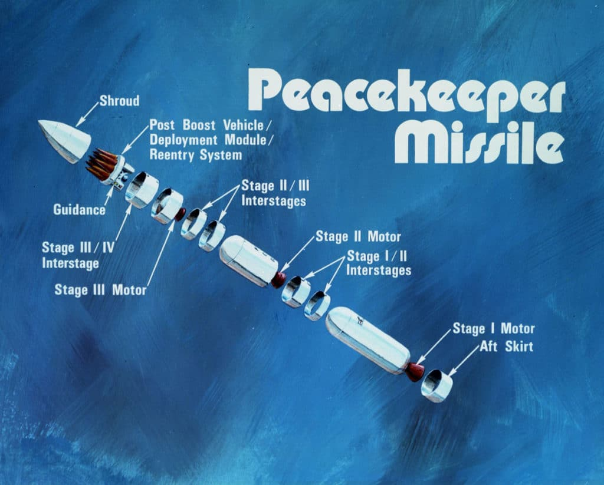

# U.S. Strategic Forces

Find the dashboard [HERE](https://mattkielar.shinyapps.io/strategicforces)

## About

`StrategicForces` contains comprehensive data on United States strategic nuclear forces between 1945 and 2023. In particular, it aims to illustrate changes in the composition of U.S. strategic force structure by providing an illustrated breakdown of weapon deployments over time, including data on:

- Delivery vehicles for each leg of the nuclear triad (e.g. ICBM, SLBM, bomber), plus theater-range forces in Western Europe

- Warheads associated with each weapons system in its respective triad leg

- Nuclear stockpile inventories, nuclear tests, and arms control agreements

- Facilities of the nuclear weapons complex

The aim is to provide a user-friendly interface where those interested in nuclear weapons and nuclear policy
can learn more about the evolution of U.S. nuclear forces and arms control throughout the last eight decades.

## Notes on Warhead and Missile Counts

Data on missile counts reflect the number of *deployed* delivery vehicles per year. Delivery vehicles kept in reserve for
flight test programs or kept as spares are not counted.

Where possible, warhead counts reflect the number of deployed and/or active warheads per year. If figures on deployed warheads are not
available for a particular year, the number of deployed warheads is calculated with the following formula:

$$\text{No. Deployed Warheads} = \text{No. Deployed Missiles} \times \text{Warheads/Missile}$$

For instance, the 1987 edition of the *SIPRI Yearbook* lists a total 250 W84 warheads for the BGM-109G GLCM in the stockpile at the end of
1987 and 208 deployed GLCM launchers for that same year. Therefore, the total number of deployed W84 warheads in 1987 is calculated as 208
with the above formula.

Some volumes of *The Military Balance* have inconsistencies in reporting the number of deployed theater-range systems. For instance, the 1974 edition of *The Military Balance* lists an approximate total of 250 Pershing IA SRBMs deployed worldwide, and also lists 72 Pershing IAs deployed under West German control. In this instance, 250 is taken as the count of deployed missiles.

## Additional Notes

Counts on bomber deployments do not include dual capable aircraft (DCA).

Nonstrategic/tactical weapons are not included due to the ambiguity of "nonstrategic" as a weapons category. Data on deployed nonstrategic
warheads per year (e.g. TLAM-N, ADM, artillery) is also sparse at best and difficult to obtain to reliable figures on.

Due to the lack of availability of data on relevant warhead deployments, as well as inconsistencies in reporting on gravity bomb modifications,
data on deployed gravity bombs only begins in 1998.

## References

**Data**

International Institute for Strategic Studies. "The Military Balance". <https://iiss.tandfonline.com/loi/tmib20>

Kristensen, Hans M. “Nuclear Notebook Archives.” Bulletin of the Atomic Scientists. <https://thebulletin.org/nuclear-risk/nuclear-weapons/nuclear-notebook/>

Natural Resources Defense Council. "NRDC: Archive of Nuclear Data". <https://web.archive.org/web/20041027155120/http://www.nrdc.org///nuclear/nudb/datainx.asp>

Our World in Data. "Estimated Nuclear Warhead Stockpiles". <https://ourworldindata.org/grapher/nuclear-warhead-stockpiles>

Our World in Data. "Nuclear Weapons Tests Per Year". <https://ourworldindata.org/grapher/number-of-nuclear-weapons-tests>

Stockholm International Peace Research Institute. "Yearbook Archive". <https://www.sipri.org/yearbook/archive>

**Technical Details**

Cochran, Thomas B., William M. Arkin, and Milton M. Hoenig. *Nuclear Weapons Databook*. Vol. 1. Ballinger Publishing Company, 1984.

Polmar, Norman, and Robert S. Norris. *The U.S. Nuclear Arsenal: A History of Weapons and Delivery Systems Since 1945*, Naval Institute Press, 2009.

Spinardi, Graham. *From Polaris to Trident: The History of U.S. Fleet Ballistic Missile Technology*, Cambridge University Press, 1994.

Stumpf, David K. *Minuteman: A Technical History of the Missile that Defined American Nuclear Warfare*, Arkansas University Press, 2020.

**Facility Information**

Arkin, William M., and Richard W. Fieldhouse. *Nuclear Battlefields: Global Links in the Arms Race*. Ballinger Publishing Company, 1985.

Harvey, John R., and John K. Warden. “Command and Control of U.S. Nuclear Forces.” In *Managing U.S. Nuclear Operations in the 21st Century*,
edited by Charles Glaser, Austin Long, and Brian Radzinsky, 167–200. Brookings Institution, 2022.

Office of Enterprise Assessments. "DOE Site List." Department of Energy. <https://www.energy.gov/ea/ea-information-doe-site/>
